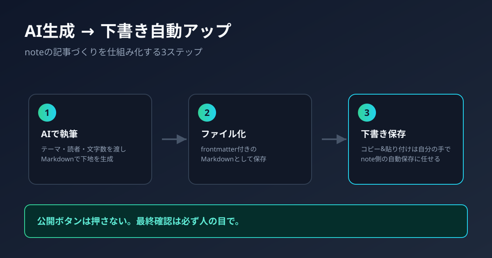

# note記事を「AI生成→下書き自動アップ」まで仕組み化する方法

## リード文

副業でnoteに記事を書いていると、「文章を考える」よりも「毎回noteを開いてタイトルを打ち直し、本文をコピペして、体裁を整える」という単純作業に地味に時間を取られていないでしょうか。

実はこの「コピペして貼り付ける」部分は、AIとブラウザ自動化ツールを組み合わせることで、下書き保存までなら仕組み化できます。この記事では、note記事を「AIで文章を作る」→「下書きとしてnoteに自動でアップする」ところまでを自動化する考え方と、実際にやってみて分かった注意点をまとめます。

## なぜ「下書きアップまで」を自動化するのか

note公式は記事投稿用のAPIを一般公開していません。将来的に公開する予定も今のところ明言されていないため、「ボタン一つで完全自動投稿」を作ろうとすると、非公式な手段に頼らざるを得ないのが実情です。

だからといって諦める必要はありません。狙いを「公開まで全自動」ではなく「下書き保存まで自動、公開は自分の目で確認してから手動」に絞れば、次の理由から十分現実的で、かつ安全にメリットを得られます。

- 執筆〜下書き化の反復作業(コピペ・体裁調整)は、実は一番時間を奪っている割に付加価値が低い
- 公開前に人間が最終チェックする工程を必ず挟めるので、誤字・事実誤認・意図しない公開を防げる
- noteのサービス仕様変更に強い(内部APIに直接依存しないほど壊れにくい)

## 全体の仕組み

やっていることは大きく3ステップです。

### 1. AIで記事の下地を作る

テーマとターゲット読者、文字数の目安をAIに渡して、タイトル・見出し構成・本文をMarkdown形式で生成します。ポイントは「Markdownで出力させる」こと。次のステップでそのまま活かせます。

### 2. Markdownファイルとして保存する

生成した記事をfrontmatter付きのMarkdownファイルとして保存します。タイトルやステータス(下書き/確認中/公開済み)をfrontmatterで管理しておくと、あとで「どの記事がどこまで進んでいるか」を一覧しやすくなります。

### 3. タイトル・本文をコピー用に整形し、貼り付けは自分の手で行う

ここが実際にやってみて方針転換したポイントです。当初は「ログイン済みブラウザを自動操作で丸ごと動かす」方式を考えていましたが、実際に試すとnote側のボット検知に引っかかり、ログイン済みのセッションを渡していてもログイン画面に強制的に戻されてしまいました。noteは自動投稿ツールを推奨していないため、これは想定内の挙動です。

そこで、自動化する範囲を次のように切り分けました。

1. 記事のタイトルを画面に表示する(自分で見てタイトル欄に入力する)
2. 本文のMarkdownテキストをクリップボードに自動でコピーしておく
3. noteの新規記事ページを普段使いのブラウザで自動的に開く
4. タイトル欄への入力と、本文欄への貼り付け(Ctrl+V)は自分の手で行う。noteのエディタは、プレーンテキストのMarkdownを貼り付けると見出し・太字・リンク・箇条書きなどを自動でnote記法に変換してくれる仕様になっているので、貼り付けるだけで体裁は整う
5. noteの自動保存機能に任せて下書き状態にする

「ログインだけは自動化しない」と割り切ることで、コピペの手間はほぼゼロにしつつ、note側の仕組みと衝突しない形に収まりました。

## 実装するときに気をつけたいポイント

### ログイン自体は自動化しない

自動操作ブラウザによるログインはボット検知で弾かれるだけでなく、パスワードやログインセッションをスクリプト側に持たせること自体がセキュリティ上のリスクになります。タイトル・本文の準備とページを開くところまでを自動化の範囲に絞り、ログインと貼り付けは必ず自分の手で行う、と割り切るのが結果的に安全です。

### 「公開」は自動化しない

これは仕組みの都合というより方針の話です。AIが生成した文章には事実誤認や不自然な表現が混ざることがあります。下書き保存までを自動化し、公開ボタンは必ず自分で押す、というルールを徹底することで、誤情報の垂れ流しを防げます。

### 非公式な仕組みであることを理解しておく

noteの内部構造(画面のレイアウトやHTMLの要素名など)は予告なく変わることがあります。自動化スクリプトが急に動かなくなることは「壊れた」のではなく「想定内」と捉え、都度調整する前提で運用するのが現実的です。

### 量産・スパム目的には使わない

この仕組みはあくまで「自分が書く記事を書く手間を減らす」ためのものです。同じような内容を大量生産して機械的に投稿する使い方は、読者にとって価値がないだけでなく、note側の規約違反やアカウント制限のリスクにもつながります。

## この仕組みで浮いた時間で何をするか

自動化で浮くのは「コピペと体裁調整」の時間だけで、「何を書くか」「読者にとって価値があるか」を考える時間は相変わらず人間の仕事です。むしろ作業時間が減った分を、

- タイトルや構成をもう一案練り直す
- 実体験や具体的な数字を足して説得力を上げる
- サムネイル画像やアイキャッチにこだわる

といった、AIが苦手な「読者への解像度を上げる作業」に回すのが、結果的に記事の質を上げる一番の近道です。

## まとめ

note記事の「AI生成→下書きアップ」は、noteに公式APIがなく自動投稿ツールも歓迎されていない状況でも、「タイトル表示・本文コピー・ページを開くところまでは自動化し、ログインと貼り付けは自分の手で行う」という形に絞れば十分実現できます。自動化してよいのは下書き保存までで、公開は必ず人間が最終確認する、というルールを守ることが、スピードと品質を両立させるコツです。

まずは1本、いつも書いている記事をMarkdownで下書きし、下書き保存だけを自動化するところから試してみてください。

## 参考・出典

- note公式ヘルプセンター「Markdownショートカット」
