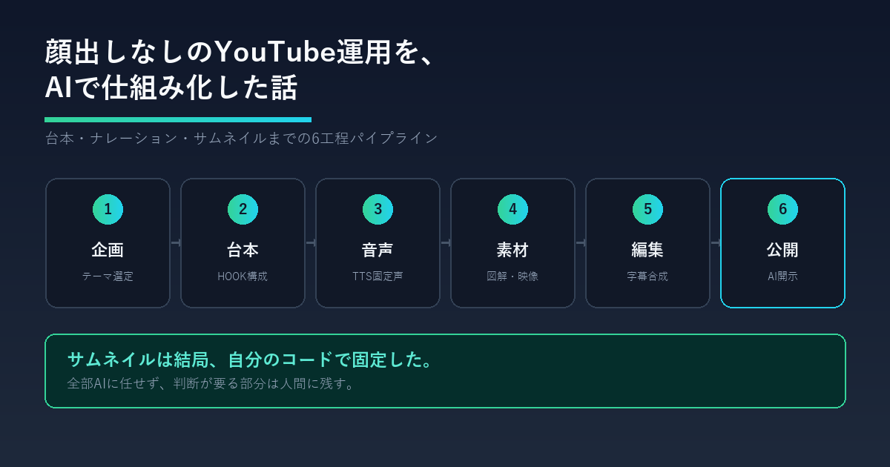

# 顔出しなしのYouTubeチャンネルを、台本からサムネイルまでAIで回してみた話

## リード文

「YouTubeで稼ぐには、顔出しして毎日しゃべり続けないといけない」。そう思って諦めていないでしょうか。

実際には、企画・台本・ナレーション・字幕・サムネイルまでを一つの制作パイプラインとして仕組み化してしまえば、顔も声も出さずに、AIを中心とした体制でチャンネルを運用できます。この記事では、実際にShorts専門のチャンネルを立ち上げ、台本からサムネイル書き出しまでの工程をAIツール中心に組み立ててみた過程と、やってみて初めて分かった落とし穴をまとめます。

## なぜ「チャンネル運用そのものをAIに任せる」を試したのか

副業としてのYouTubeは、参入障壁が「継続」にあります。ネタ切れ、編集の手間、サムネイル制作の手間——このどれか一つでも重いと、数本で更新が止まってしまいます。

一方で、台本の型・ナレーションの声・サムネイルのレイアウトを一度「仕組み」として固定してしまえば、次の話数を作るコストは大きく下がります。「AIに何を書かせるか」より先に「毎回何を固定し、何を差し替えるか」を決めておくことが、継続できるチャンネル運用の鍵だと考え、実際に手を動かして検証しました。

## どんなチャンネルを作ったか

今回作ったのは、海外の英語圏視聴者向けに「日本の当たり前」の裏にある理由を解説する、顔出しなし(faceless)のShortsチャンネルです。

ジャンル選定で意識したのは、次の2点です。

- **一次情報で差別化できる領域を選ぶ**:「日本は不思議で綺麗」という感覚的な語りは、海外の類似チャンネルに既に溢れています。日本在住・日本語ネイティブという立場を活かし、「なぜそうなっているか」を制度や歴史の因果として説明する構造的な視点に絞りました
- **フォーマットを数値で固定する**:尺は60〜90秒(英語で130〜180語)、構成は「HOOK(0-3秒)→SETUP(3-15秒)→PAYOFF(15-68秒)→BUTTON(68-80秒)」という型に統一。ネタが変わっても型は変えないことで、台本作成そのものを再現可能な作業にしました

「何について話すか」は毎回違っても、「どういう順番で、何秒で話すか」を固定したことで、台本作成の負荷が大きく下がりました。

## 仕組み化した6つの工程

実際に組んだ制作パイプラインは、次の6工程です。

### 1. 企画・リサーチ

チャンネルの3本柱(ものづくり・技術・デザインの背後にある「なぜ」)に沿ってテーマを選び、事実確認を行います。ここは今のところ人間の仕事です。AIに丸投げすると、事実誤認や「日本すごい」系の陳腐な切り口に寄りがちなためです。

### 2. 台本執筆

HOOK/SETUP/PAYOFF/BUTTONのテンプレートに沿って台本を書きます。AIコーディングツールに型とテーマを渡せば下地はすぐ出ますが、「各話に独自の視点を必ず入れる」ことをルール化しました。型だけで量産すると、内容が薄い量産コンテンツと見なされるリスクがあるためです。

### 3. ナレーション生成

台本からナレーション文だけを抜き出し、ElevenLabsのTTSで音声化します。ここで重要なのは、声を毎話固定することです。声が話数ごとに変わると、視聴者がチャンネルを覚えられません。声質・話速・安定性のパラメータをすべて数値で固定し、以降の話数はその設定をそのまま使い回しています。

### 4. 絵コンテ・素材生成

ショットごとの対応表を作り、動画生成AI向けのプロンプトを整理します。映像は生成AIが中心ですが、図解だけは自作しています。生成AIに図解を任せると、テキストが崩れたり数値が不正確になったりすることが多く、正確性が求められる図解には向いていないと判断したためです。

### 5. 編集・合成

音声と映像素材を編集ソフトで合成します。字幕は必須にしています。無音のまま視聴する人が8割という前提に立つと、字幕なしの動画はほぼ「音声だけの動画」と同じ扱いになってしまうためです。

### 6. 公開設定・メタデータ

タイトル・説明文・タグに加えて、AI利用の開示メモを毎話必ず作成します。ここは仕組み化というより、守るべきルールの明文化です。

## 全部AIに任せたわけではない部分

「AIにチャンネル運用を任せる」と言うと全自動を想像しがちですが、実際に手を動かしてみると、人間が握っておくべき部分が明確に見えてきました。

- **視点・切り口の決定**:テンプレートは型であって内容ではありません。「何を面白いと思うか」を決めるのは人間の仕事です
- **本編映像そのものの生成実行**:プロンプトの設計まではパイプラインに組み込みましたが、実際の生成ボタンを押す工程は意図的に手動のまま残しています。生成結果の当たり外れが大きく、都度目で見て選別する必要があるためです
- **AI開示設定**:実写と誤認しうる生成映像を使った回だけ、YouTubeの「変更または合成コンテンツ」の開示トグルをONにする、というルールを徹底しています。図解や音声だけの回は対象外です。この線引きを自動化はせず、話数ごとに人間が判断しています

「型と反復作業はAI、判断が要る部分は人間」という線引きを最初に決めておいたことで、後から「これはAIに書かせていいのか」と迷う場面がほぼなくなりました。

## やってみて分かった落とし穴:サムネイルは結局、自作に戻した

当初はサムネイルもAI画像生成で作る想定でした。しかし実際に運用を進める中で、使っていた生成ツールの無料プランでは想定していた画像生成モデルが使えないことが判明し、方針を転換しました。

最終的に落ち着いたのは、次の方式です。

- サムネイルのレイアウト(煽り文言・大きな問い・答えの予告・中央の図解)をSVGで設計図として残す
- 実際の書き出しは、Pythonの画像処理ライブラリでレイアウトをコードとして再現し、PNGとして出力する

一見遠回りに見えますが、レイアウトの座標やフォントサイズをコードで固定できるため、話数が増えてもブランドの見た目が崩れないという副次的なメリットがありました。「AIツールが使えない状況に当たったら、その部分だけ枯れた技術(自分で書けるコード)に置き換える」という判断は、AIツールを使いこなす副業をやる上で汎用的に効く考え方だと思います。

## 今のところの進捗

チャンネル自体は開設済みで、6話分の台本・ナレーション・ラフカット・サムネイルまでを一連の工程で作成できるところまで来ました。本格的な連続公開はこれからのフェーズです。「仕組みを作り切ってから量産する」方針を取っているため、公開本数を急いで増やすより、パイプラインの再現性を先に固めることを優先しています。

## これからYouTube×AIを副業にしたい人へのヒント

- **ジャンルは「一次情報で語れる範囲」に絞る**:感覚的な語りはAIでも量産できてしまう分、差別化になりません
- **フォーマットを先に数値で固定する**:尺・構成・声・配色を決めてから台本を書き始めると、2本目以降が圧倒的に楽になります
- **全工程を自動化しようとしない**:判断が必要な部分(視点決め・生成結果の選別・開示設定)は人間に残した方が、結果的に速く安定します
- **AIツールが使えなくなる前提で設計する**:無料プランの制限やサービス仕様変更は起こるものと考え、要所は自分で再現できる形(コードや設計図)を残しておく

## まとめ

YouTubeチャンネルの運用は、「AIに全部任せる」のではなく、「型を決めて反復作業をAIに渡し、判断が要る部分だけ人間が握る」ことで仕組み化できます。台本の構成、ナレーションの声、サムネイルのレイアウトといった「毎回変えないもの」を先に固定してしまえば、ネタが変わっても制作コストは大きく増えません。

これからYouTube×AIの副業を検討している方は、いきなり毎日投稿を目指すのではなく、まず1話分を通しで作ってみて、どこを固定し、どこを自分の判断に残すかを言語化するところから始めてみてください。

## 参考・出典

-
